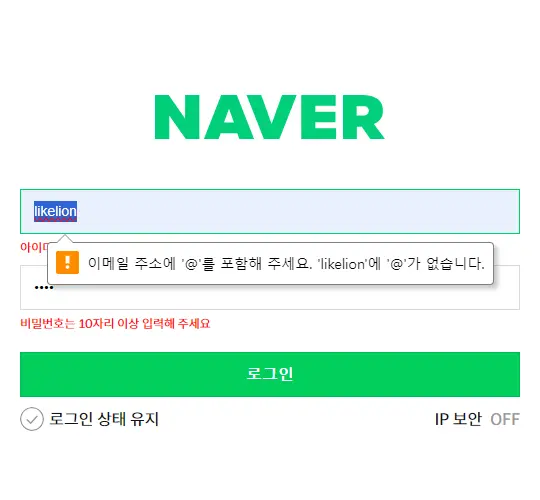
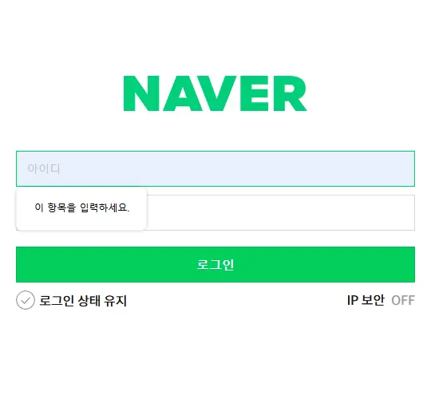
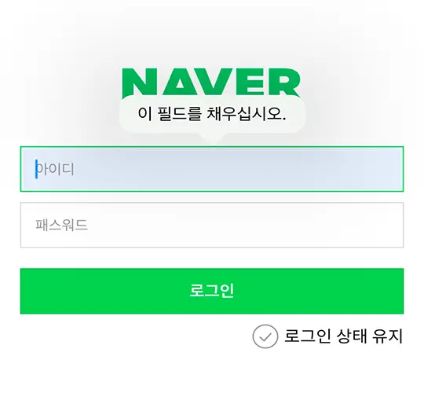

# [login](../login/login.html)🔗

## 구조

```html
<section class="login">
  <h1 class="logo">
    <a href="#"><span class="sr-only">NAVER</span></a>
  </h1>
  ...
</section>
```

로고는 `h1` 태그를 사용하여 svg 로고 이미지를 배경으로 넣어 주었습니다.

```html
<form action="" method="post">
  <label for="" class="input-label">
    <input type="email" class="input-block" placeholder="아이디" name="userId" required />
    <strong class="invalid-txt">아이디는 이메일을 입력해 주세요</strong>
  </label>
  <label for="" class="input-label">
    <input type="password" class="input-block" placeholder="패스워드" name="userPw" minlength="10" required />
    <strong class="invalid-txt">비밀번호는 10자리 이상 입력해 주세요</strong>
  </label>
  <div class="btn-wrap">
    <button type="submit" class="btn primary">로그인</button>
  </div>
  ...
</form>
```

입력 필드는 lable로 감싸주어 컴포넌트로 만들었습니다. input의 형제로 유효성 검사 에러 메시지를 넣어 주어 `:valid`, `:invalid` 속성과 `+`선택자로 제어 가능하도록 했습니다.

아이디와 패스워드는 필수 입력값이므로 `input`에 `required` 속성을 주었고,
비밀번호의 에러 메세지가 **10자리 이상**이므로 `minlength="10"` 속성과 값을 주었습니다.

버튼은 primary, secondary가 같이 있는 경우를 고려하여 `btn-wrap`로 감싸 주었습니다.

submit 버튼을 로그인 상태 유지, IP 보안 스위치 버튼 다음으로 마크업 하는 것을 고려했으나,
옵셔널한 요소이므로 아이디와 패스워드 다음에 바로 포커스가 가는 순서로 마크업 했습니다.

```html
<div class="form-option">
  <label for="keepLogin" class="input-check-label">
    <input type="checkbox" id="keepLogin" name="keepLogin" />
    <span>로그인 상태 유지</span>
  </label>
  <a href="./pages/ip_security.html" class="txt-link mobile-hidden" target="_blank" aria-haspopup="true">IP 보안</a>
  <label for="" class="input-switch mobile-hidden">
    <input type="checkbox" class="input-switch__button" name="ipSecurity" />
    <strong class="input-switch__txt on">ON</strong>
    <span class="input-switch__txt off">OFF</span>
  </label>
</div>
```

로그인 상태 유지와 IP 보안 버튼은 Boolean 값이기 때문에 `input` `type="checkobox"`로 만들었고, `:checked`속성과 `+`, `~`선택자로 ON/OFF 텍스트를 토글시키기 위해 checkbox의 형제 위치에 ON/OFF 텍스트가 오도록 했습니다.

IP 보안 링크는 새창으로 띄우기 위해 `target="_blank"` 속성과 새창으로 뜨는 것을 알 수 있도록 `aria-haspopup="true"` 속성을 주었습니다.

## 스타일링

form 요소의 기본 agent style을 확인하기 위해 reset/nomalize css를 불러오지 않았습니다.

form 요소는 재사용이 빈번하므로 선택자를 nesting 하여 작성하지 않고 독립적으로 사용할 수 있도록 컴포넌트와 레이아웃의 css를 분리하였습니다.

### 🔎 미디어쿼리

로고와 로고의 상하단 여백 외에는 모바일과 데스크탑의 사이즈가 동일하여, 크기가 달라지는 요소 내에 미디어쿼리를 작성하였습니다.

데스크탑에서만 보이는 요소가 있기 때문에 `mobile-hidden` 클래스로 분기하여 모바일에서는 안보이도록 했습니다.

### 🔎 [Client-side form validation](https://developer.mozilla.org/en-US/docs/Learn/Forms/Form_validation)

**validation css selector** 키워드로 `:invalid` 속성이 있다는 것을 찾았습니다.

`:invalid` 선택자만 넣으니 입력하기 전에도 에러메세지가 노출되어 수정이 필요했습니다.
키워드로 찾으면 좋아겠지만, 결국 누군가 예시로 만든 페이지에서 [`:placeholder-shown`](https://caniuse.com/css-placeholder-shown) 선택자를 찾았습니다. 🙃

`:invalid:not(:placeholder-shown)` 선택자로 값이 유효하지 않고 placeholder가 보이지 않을 때 에러메세지가 노출되도록 했고, 스크린리더가 검증에 대한 메세지를 읽을 수 있도록 `aria-live="polite"` 속성을 주었습니다.

#### form 관련 aria 속성

- [aria-invalid](https://developer.mozilla.org/en-US/docs/Web/Accessibility/ARIA/Attributes/aria-invalid)
- [aria-required](https://developer.mozilla.org/en-US/docs/Web/Accessibility/ARIA/Attributes/aria-required)


CSS만으로 입력 필드가 빈값인 상태에서 로그인 버튼 클릭 시 에러메세지가 노출되는 것은 구현하지 못했습니다. 😭

### 🔎 버튼 컴포넌트

스타일 확장이 용이하도록 `btn`과 `primary` 클래스를 따로 주어 primary 클래스가 없어도 기본적으로 버튼 스타일이 유지되도록 했습니다.

### 🔎 input style

`::placeholder`, `:focus-visible` 가상 선택자로 placeholder와 키보드 조작 시 요소에 포커스가 되었을 때 스타일을 설정해 주었습니다.

`:focus`와 차이를 보니 `:focus`는 클릭을 할 때에도 outline이 생기는 것을 확인하였습니다.

### 🔎 checkobx & switch style

checkbox의 checked 유무 스타일링을 위해 `:checked` 가상선택자를 사용했습니다.
checkbox의

### ❓궁금증

로고와 체크박스 아이콘 이미지는 svg 코드를 css로 변환하여 사용했는데, 파일로 불러오는 것과 성능 차이가 있는지 찾아봐야 할 것 같습니다.

## 결과화면

### 크롬



### 파이어폭스



### 모바일 safari



## 마치며

input의 type을 구체적으로 지정하면 **Client-side form validation**로 어느 정도 검증을 거칠 수 있기 때문에 스크립트로 구현하던
